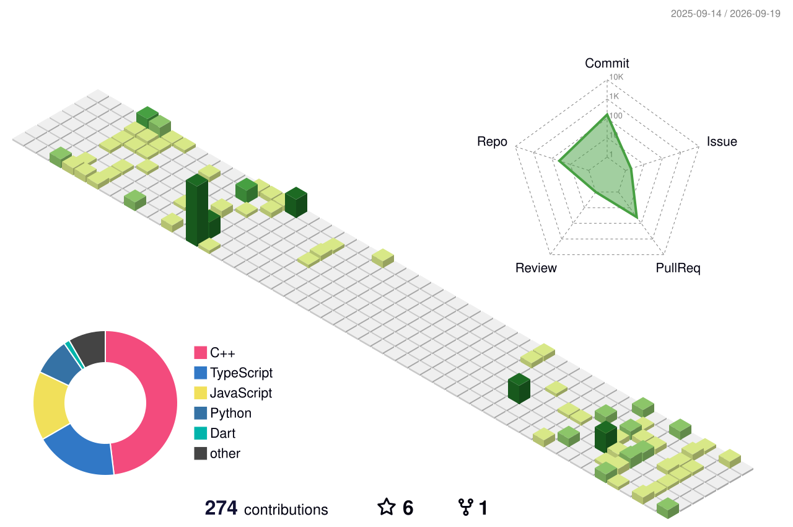

<!-- ═══════════════════════════════════════════════════════════════════════
     ⚡ WIZARDING DEVELOPER PROFILE — GRYFFINDOR EDITION ⚡
     Premium Harry Potter themed GitHub Profile README
     Replace lucifer0612 with your actual GitHub username throughout
     ═══════════════════════════════════════════════════════════════════════ -->

<!-- ╔══════════════════════════════════════════════════════════════╗
     ║  SECTION 1 : MARAUDER'S MAP HEADER (custom animated SVG)  ║
     ╚══════════════════════════════════════════════════════════════╝ -->

<picture>
  <source media="(prefers-color-scheme: dark)" srcset="./assets/marauders-map-header.svg"/>
  
</picture>

<!-- ╔══════════════════════════════════════════════════════════════╗
     ║  SECTION 2 : ANIMATED TYPING SPELL INCANTATION              ║
     ╚══════════════════════════════════════════════════════════════╝ -->

 

  

<!-- ╔══════════════════════════════════════════════════════════════╗
     ║  SECTION 3 : HOUSE IDENTITY BADGES                          ║
     ╚══════════════════════════════════════════════════════════════╝ -->

 

<!-- ╔══════════════════════════════════════════════════════════════╗
     ║  SECTION 4 : ABOUT ME — THE SORTING HAT'S VERDICT          ║
     ╚══════════════════════════════════════════════════════════════╝ -->

<picture>
  <source media="(prefers-color-scheme: dark)" srcset="./assets/patronus-phoenix.svg"/>
  
</picture>

## 🏰 The Sorting Hat's Verdict

> *"Plenty of courage, I see. Not a bad mind either. There's talent, oh my goodness, yes — and a nice thirst to prove yourself, now that's interesting... Better be — **GRYFFINDOR!**"*

I'm **Ashutosh Kesarwani**, a **Wizard-in-Training** at **IIIT Allahabad**, currently mastering the dark arts of **Web Development** and **Open Source**. With **51 repositories** and active contributions to **OpenCode IIITA**, I'm forging digital artifacts at the intersection of elegant code and boundless curiosity.

- 🔮 **Current Quest** — Learning Full-Stack Web Development & contributing to Open Source
- 📜 **Mastered O.W.L.s** — C, C++, Java, Python, JavaScript, TypeScript, HTML5, CSS3, MySQL
- 🦉 **Open Source** — Active contributor to **OpenCode IIITA** (Cyber_lens, CodeCraft, DING, Subsentry & more)
- 🏆 **Achievements** — Pull Shark x2 • YOLO • Quickdraw • GitHub Pro • 6⭐ on MicroMaker
- ⚡ **Life Motto** — *"It is our choices that show what we truly are, far more than our abilities."*

 

  <picture>
    <source media="(prefers-color-scheme: dark)" srcset="./assets/golden-snitch-divider.svg"/>
    
  </picture>

<!-- ╔══════════════════════════════════════════════════════════════╗
     ║  SECTION 5 : TECH STACK — THE WAND CHOOSES THE WIZARD      ║
     ╚══════════════════════════════════════════════════════════════╝ -->

## 🪄 Wand & Spellbook

*The wand chooses the wizard, Mr. Potter. The tech stack chooses the developer.*

 

<!-- Animated wand shooting spell particles into the tech stack -->
<picture>
  <source media="(prefers-color-scheme: dark)" srcset="./assets/wand-casting-spell.svg"/>
  
</picture>

 

### ✦ Charms — Core Languages

  

### ✦ Transfiguration — Frameworks & Tools

  

### ✦ Artifacts — Data & Creative Tools

  

  <picture>
    <source media="(prefers-color-scheme: dark)" srcset="./assets/golden-snitch-divider.svg"/>
    
  </picture>

<!-- ╔══════════════════════════════════════════════════════════════╗
     ║  SECTION 6 : FEATURED PROJECTS — MAGICAL ARTIFACTS          ║
     ╚══════════════════════════════════════════════════════════════╝ -->

## ⚡ Magical Artifacts — Featured Projects

<table>
  <tr>
    <td width="50%" valign="top">
      <h3 align="center">🚀 MicroMaker</h3>
      

        
      

      

        
        
      

      
<em>Micromaker Website — 6⭐ and growing. "I solemnly swear that I am building something great."</em>

    </td>
    <td width="50%" valign="top">
      <h3 align="center">📝 HackLog</h3>
      

        
      

      

        
      

      
<em>Log your Hackathon journey — analyze performance & mistakes for upcoming events.</em>

    </td>
  </tr>
  <tr>
    <td width="50%" valign="top">
      <h3 align="center">💻 LeetCode Solutions</h3>
      

        
      

      

        
      

      
<em>Competitive programming spellbook — daily practice makes the wizard.</em>

    </td>
    <td width="50%" valign="top">
      <h3 align="center">🔍 Cyber Lens</h3>
      

        
      

      

        
        
      

      
<em>Threat-intelligence aggregator — checks IPs, domains & hashes against security feeds. (OpenCode IIITA)</em>

    </td>
  </tr>
</table>

  <picture>
    <source media="(prefers-color-scheme: dark)" srcset="./assets/golden-snitch-divider.svg"/>
    
  </picture>

<!-- ╔══════════════════════════════════════════════════════════════╗
     ║  SECTION 7 : GITHUB STATS — THE MARAUDER'S TELEMETRY       ║
     ╚══════════════════════════════════════════════════════════════╝ -->

<!-- Floating Candles — Great Hall atmosphere above stats -->

## 🗺️ Marauder's Telemetry

 

<!-- Streak Stats with Gryffindor Colors -->
<picture>
  <source media="(prefers-color-scheme: dark)" srcset="https://github-readme-streak-stats.herokuapp.com/?user=lucifer0612&background=0d1117&border=740001&stroke=740001&ring=EEBA30&fire=EEBA30&currStreakNum=EEBA30&sideNums=E5E7EB&currStreakLabel=EEBA30&sideLabels=EEBA30&dates=8b949e"/>
  
</picture>

### 🏆 Gringotts Vault Achievements

  

 

  <picture>
    <source media="(prefers-color-scheme: dark)" srcset="./assets/golden-snitch-divider.svg"/>
    
  </picture>

<!-- ╔══════════════════════════════════════════════════════════════╗
     ║  SECTION 8 : CONTRIBUTION SNAKE ANIMATION                   ║
     ╚══════════════════════════════════════════════════════════════╝ -->

## 🐍 The Chamber of Contributions

*"Even the basilisk leaves a trail..."*

 

<picture>
  <source media="(prefers-color-scheme: dark)" srcset="https://raw.githubusercontent.com/Lucifer-0612/Lucifer-0612/output/github-snake-dark.svg"/>
  <source media="(prefers-color-scheme: light)" srcset="https://raw.githubusercontent.com/Lucifer-0612/Lucifer-0612/output/github-snake.svg"/>
  
</picture>

 

> *Set up the [Platane/snk](https://github.com/Platane/snk) GitHub Action in your profile repo to auto-generate this animation.*

  <picture>
    <source media="(prefers-color-scheme: dark)" srcset="./assets/golden-snitch-divider.svg"/>
    
  </picture>

<!-- ╔══════════════════════════════════════════════════════════════╗
     ║  SECTION 9 : RESTRICTED SECTION — COLLAPSIBLE DETAILS       ║
     ╚══════════════════════════════════════════════════════════════╝ -->

## 🔒 The Restricted Section

  
<b>🗝️ Cast <code>Alohomora</code> to unlock secret research...</b>

   

  ### 📜 Experimental Spells in Development

  

    
  

  
  | Spell | Description | Status |
  | :--- | :--- | :---: |
  | 🧬 **Polyjuice Neural Transfer** | PyTorch image style-transfer model for real-time visual morphing | 🔬 Research |
  | 📡 **Owl Post P2P** | Decentralized encrypted messaging on WebRTC & libp2p | 🏗️ Building |
  | 🌌 **Pensieve RAG** | Personal knowledge base with retrieval-augmented memory | ✅ Alpha |
  | 🎯 **Nimbus 2000 Runtime** | WASM-powered edge computing framework for low-latency spells | 💡 Concept |
  
  ### 🎓 N.E.W.T. Certifications
  
  - ☁️ AWS Solutions Architect — Professional
  - 🐳 Certified Kubernetes Administrator (CKA)
  - 🔐 CompTIA Security+
  
   

  > *"You will find that I will only truly have left this school when none here are loyal to me." — Dumbledore*

  <picture>
    <source media="(prefers-color-scheme: dark)" srcset="./assets/golden-snitch-divider.svg"/>
    
  </picture>

<!-- ╔══════════════════════════════════════════════════════════════╗
     ║  SECTION 10 : ACTIVITY GRAPH                                ║
     ╚══════════════════════════════════════════════════════════════╝ -->

## 🪪 Magical Accolades (Holopin)

 

<!-- Holopin Badges -->

  <picture>
    <source media="(prefers-color-scheme: dark)" srcset="./assets/golden-snitch-divider.svg"/>
    
  </picture>

<!-- ╔══════════════════════════════════════════════════════════════╗
     ║  SECTION 10a : HOGWARTS EXPRESS PROGRESS BAR               ║
     ╚══════════════════════════════════════════════════════════════╝ -->

## 🚂 The Hogwarts Express

 

  <picture>
    <source media="(prefers-color-scheme: dark)" srcset="./assets/golden-snitch-divider.svg"/>
    
  </picture>

<!-- ╔══════════════════════════════════════════════════════════════╗
     ║  SECTION 10b : 3D CONTRIBUTION CALENDAR                    ║
     ╚══════════════════════════════════════════════════════════════╝ -->

## 🏰 The Hogwarts Skyline

*"Every commit builds a tower, every PR opens a gate."*

 

<!-- 3D contribution calendar — generated by .github/workflows/profile-3d.yml -->
<!-- Run the action manually first, then uncomment the image below -->
<!-- After the GitHub Action runs, it generates files in profile-3d-contrib/ -->

<picture>
  <source media="(prefers-color-scheme: dark)" srcset="./profile-3d-contrib/profile-night-rainbow.svg"/>
  
</picture>

 

> *Set up the [yoshi389111/github-profile-3d-contrib](https://github.com/yoshi389111/github-profile-3d-contrib) GitHub Action to auto-generate this 3D calendar.*

  <picture>
    <source media="(prefers-color-scheme: dark)" srcset="./assets/golden-snitch-divider.svg"/>
    
  </picture>

<!-- ╔══════════════════════════════════════════════════════════════╗
     ║  SECTION 11 : CONTACT — SEND AN OWL                        ║
     ╚══════════════════════════════════════════════════════════════╝ -->

## 🦉 Send an Owl

*Got a project idea? Want to discuss wizardry & code? My owlery is always open.*

 

&nbsp;

&nbsp;

&nbsp;

  

<!-- ASCII OWL replaced by animated Quill Signature -->

<!-- ╔══════════════════════════════════════════════════════════════╗
     ║  SECTION 12 : ANIMATED QUILL SIGNATURE FOOTER              ║
     ╚══════════════════════════════════════════════════════════════╝ -->

<picture>
  <source media="(prefers-color-scheme: dark)" srcset="./assets/quill-signature-footer.svg"/>
  
</picture>

